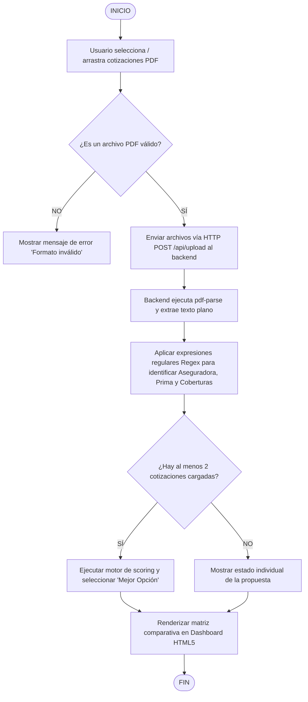

| **Nombre:** Carlos de Jesus Colorado Quiroz | **Matrícula:** 2631633 |
|---|---|
| **Nombre del curso:** Taller de productividad basada en herramientas tecnológicas | **Nombre del profesor:** Rey Moisés Vásquez Hernández |
| **Módulo:** 1 | ***Actividad:*** 2 |
| **Fecha:** 25/07/2026 | |

# SISTEMA WEB DE AUTOMATIZACIÓN Y COMPARACIÓN DE COTIZACIONES DE SEGUROS (SegurosCompare)

---

## 1. Definición de la Organización, Área, Justificación y Problemática

### 1.1 Organización Seleccionada
- **Nombre de la Empresa / Organización:** Agencia & Promotoría de Seguros (Sector Servicios Financieros y Seguros).
- **Área de Trabajo:** Área de Suscripción, Operaciones y Cotizaciones Póliza Empresarial / Daños.
- **Involucramiento del Área de TI / Sistemas:** El proyecto se desarrolla bajo el consentimiento de la dirección operativa y el área de tecnología para la adopción de herramientas open source.

### 1.2 Justificación de la Elección
La elección de esta organización obedece a razones operativas críticas del sector asegurador:
1. **Volumen y Frecuencia:** La agencia procesa mensualmente decenas de licitaciones y renovaciones de pólizas de daños (Condominios, Edificios Comerciales, Empresas), donde cada proceso requiere cotizar simultáneamente con entre 3 y 8 aseguradoras (GNP, MAPFRE, INBURSA, CHUBB, Tokio Marine, etc.).
2. **Ineficiencia Operativa Medible:** Actualmente, los analistas leen manualmente documentos PDF que varían entre 6 y 30 páginas por cotización para capturar manualmente más de 40 conceptos en tablas de Excel (primas netas, derechos de póliza, IVA, sumas aseguradas por ramo, sublímites de remoción de escombros, deducibles en UMA/porcentaje y cláusulas especiales).
3. **Alto Riesgo de Error Humano:** Transcribir cifras financieras de formato PDF a Excel de manera manual genera omisiones en exclusiones de coberturas críticas (ej. omitir un deducible o una exclusión de hidrometeorológicos) que comprometen la asesoría patrimonial al cliente final.

### 1.3 Problemática Identificada a Mitigar
- **Lentitud en el Tiempo de Respuesta (SLA):** El armado manual de una tabla comparativa toma en promedio entre 2.5 y 4 horas por cliente.
- **Falta de Estandarización:** Cada aseguradora emite su cotización en PDF con estructuras, términos y formatos visuales heterogéneos.
- **Vulnerabilidad de Datos y Falta de Trazabilidad:** Las hojas de cálculo no cuentan con control de versiones ni auditoría automática de decisiones.

---

## 2. Diagrama de Bloques de la Solución Propuesta

El sistema se estructura en 4 bloques funcionales principales:

### Descripción de los Bloques:
1. **Módulo de Entrada (Ingestión):** Recibe N archivos PDF simultáneos sin requerir conversión previa.
2. **Motor de Extracción (Parsing):** Analiza el flujo de bytes, convierte el PDF a cadenas de texto y aplica expresiones regulares (Regex) y heurística para mapear variables (Primas, Coberturas, Sumas).
3. **Motor de Scoring:** Calcula una puntuación normalizada considerando costo (Prima Neta), amplitud de cobertura y completitud de datos.
4. **Capa de Presentación:** Muestra el Dashboard en diseño dinámico, responsivo y sin datos precargados (Empty State inicial).

---

## 3. Especificación de Requerimientos

### 3.1 Requerimientos Funcionales (RF)

| ID | Nombre | Descripción |
|---|---|---|
| **RF-01** | Carga Múltiple de PDFs | El sistema debe permitir subir simultáneamente 1 o más archivos PDF de cotizaciones mediante selección o arrastrar y soltar (drag & drop). |
| **RF-02** | Reconocimiento de Aseguradora | El sistema debe identificar automáticamente la compañía emisora (GNP, MAPFRE, INBURSA, CHUBB, etc.) mediante patrones de texto. |
| **RF-03** | Extracción de Cifras Financieras | El sistema debe extraer la Prima Neta, Prima Total, Moneda (USD/MXN) y desglose de Sumas Aseguradas (Edificio, Contenidos, RC, etc.). |
| **RF-04** | Detección de Coberturas | El sistema debe identificar la presencia o ausencia de coberturas clave (Incendio, FHM, Terremoto, Cristales, Maquinaria) e indicar su estado (Amparada / No detectada). |
| **RF-05** | Motor de Selección "Mejor Opción" | El algoritmo debe evaluar las propuestas cargadas y generar una recomendación justificada basada en costo-beneficio. |
| **RF-06** | Limpieza de Sesión | El usuario debe poder reiniciar la comparación borrando los datos cargados mediante un botón de "Limpiar Datos". |
| **RF-07** | Exportación de Reporte | El sistema debe permitir exportar la vista comparativa a formato PDF o impresión limpia para cliente final. |

### 3.2 Requerimientos de Interfaz Externa (RIE)

- **RIE-01 (Navegador Web):** La interfaz debe ser 100% compatible con Google Chrome, Microsoft Edge, Mozilla Firefox y Safari sin requerir plugins adicionales.
- **RIE-02 (Archivos PDF):** Compatibilidad con estándares PDF 1.4 a 1.7 generados por sistemas core de aseguradoras.
- **RIE-03 (API REST):** Comunicación entre Frontend y Backend mediante JSON sobre HTTP/HTTPS (`GET /api/proposals`, `POST /api/upload`, `DELETE /api/proposals`).

### 3.3 Requerimientos de Diseño y Atributos de Calidad (RNC)

- **RNC-01 (Estética y Modo Claro):** Diseño visual limpio en paleta de colores claros profesional (`#f1f5f9`), tipografía legible (*Outfit* y *Plus Jakarta Sans*) y distinción cromática sin el uso de símbolos informales o inapropiados.
- **RNC-02 (Desempeño):** El tiempo de procesamiento y renderizado de hasta 5 PDFs de 20 páginas no debe exceder los 3 segundos.
- **RNC-03 (Usabilidad - Estado Inicial Vacío):** La aplicación debe iniciar en estado neutral (empty state) sin datos duros o ficticios precargados.

### 3.4 Requerimientos de Seguridad y Código Abierto (RS)

- **RS-01 (Privacidad de Archivos):** Los archivos subidos deben guardarse en un directorio temporal aislado (`uploads/`) sin exposición pública directa vía URL.
- **RS-02 (Sanitización de Archivos):** Validación estricta del tipo MIME (`application/pdf`) para evitar ejecución de scripts maliciosos.
- **RS-03 (Licenciamiento Open Source):** Estructuración del código para hospedaje público en GitHub bajo Licencia MIT, libre de credenciales hardcodeadas, tokens o datos sensibles de clientes.

---

## 4. Dependencia y Prioridad de Funcionalidades

| Elemento / Módulo | Funcionalidad | Dependencia | Prioridad | Justificación de Prioridad |
|---|---|---|---|---|
| **Módulo Core Backend** | Servidor Express & API REST (`server.js`) | Ninguna | **Alta (Must Have)** | Infraestructura base para comunicación y procesamiento. |
| **Módulo Parsing** | Extracción de Texto PDF (`pdf-parse`) | Servidor Backend | **Alta (Must Have)** | Sin extracción de texto no hay datos para comparar. |
| **Módulo Parsing** | Heurística e Identificación de Aseguradora/Primas | Extracción PDF | **Alta (Must Have)** | Núcleo de la inteligencia de lectura de datos. |
| **Módulo Frontend** | Dashboard Base & Navegación por Pestañas | API REST | **Alta (Must Have)** | Permite visualizar los contenedores y navegación. |
| **Módulo Frontend** | Estado Vacío (Empty State Inicial) | Dashboard Base | **Alta (Must Have)** | Requerimiento de arranque limpio del sistema. |
| **Módulo Algoritmos** | Engine de Recomendación "Mejor Opción" | Heurística PDF | **Media (Should Have)** | Agrega valor analítico al seleccionar automáticamente la mejor opción. |
| **Módulo Frontend** | Matriz Dinámica de Coberturas y Sumas | API proposals | **Media (Should Have)** | Desglose detallado para el analista de seguros. |
| **Módulo Exportación** | Generador de PDF / Impresión Ejecutiva | Dashboard Base | **Baja (Nice to Have)** | Salida para presentación al cliente final. |
| **Módulo Operativo** | Botón de Reset / Limpiar Datos | API DELETE | **Baja (Nice to Have)** | Facilita el inicio de una nueva cotización. |

---

## 5. Resumen de Entregables del Proyecto Integrador

1. **Código Fuente Completo:** Estructurado en carpeta `/public` y `server.js` bajo arquitectura Node.js / Express.
2. **Repositorio Público GitHub:** Configurado con `.gitignore`, `LICENSE` (MIT) y `README.md` explicativo para la comunidad de código libre.
3. **Documentación Técnica Académica:** Especificación de Requerimientos y Diagramas de Arquitectura (presente documento).
