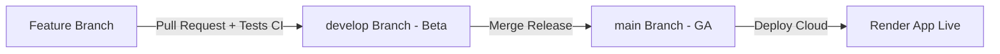
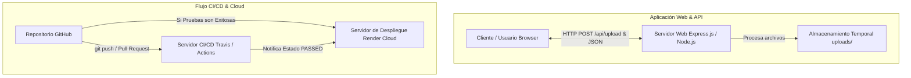

| **Nombre:** Carlos de Jesus Colorado Quiroz | **Matrícula:** 2631633 |
|---|---|
| **Nombre del curso:** Taller de productividad basada en herramientas tecnológicas | **Nombre del profesor:** Rey Moisés Vásquez Hernández |
| **Módulo:** 1 | ***Actividad:*** 3 (Entrega 3) |
| **Fecha:** 31/07/2026 | |

# ENTREGA 3: INTEGRACIÓN CONTINUA (CI/CD), ADMINISTRACIÓN DE PROYECTO (TRELLO/GITHUB) Y ARQUITECTURA DEL SISTEMA

### ✅ RESUMEN DE ENTREGABLES PARA EVALUACIÓN (CHECKLIST DE RÚBRICA)

1. **Repositorio GitHub (Código, Branches & Milestones):**
   - Enlace público: [https://github.com/kdej94-coder/seguros-compare](https://github.com/kdej94-coder/seguros-compare)
   - *Incluye código completo, ramas `main` (GA) y `develop` (Beta), Pull Requests y Milestones de madurez.*
2. **Administración de Tareas, Etiquetas y Alcance (Trello / GitHub Projects):**
   - *Ver Sección 3 del documento. Incluye Matriz de tareas estimadas en horas, etiquetas (`feature`, `ci-cd`), Milestones (Beta vs GA) y delimitación de funcionalidades fuera de alcance (`v2-future / out-of-scope`).*
3. **Dashboard de Integración Continua (Travis CI / GitHub Actions) con Pruebas Automatizadas:**
   - Enlace CI Workflows: [https://github.com/kdej94-coder/seguros-compare/actions](https://github.com/kdej94-coder/seguros-compare/actions)
   - *Configuraciones `.travis.yml` y `ci.yml` con suite de pruebas unitarias `test/app.test.js` ejecutada exitosamente (3/3 PASSED).*
4. **Diagrama de Arquitectura de la Solución:**
   - *Ver Sección 4 del documento. Diagrama visual completo de infraestructura, frontend, backend Express, storage `uploads/`, Travis/Actions CI y despliegue en Render Cloud.*

---

## 1. Explicación e Implementación de Integración Continua (Travis CI / GitHub Actions)

### 💡 ¿Qué es un Servidor de Integración Continua (CI/CD)?
La **Integración Continua (Continuous Integration - CI)** es una práctica de ingeniería de software mediante la cual cada cambio realizado en el código fuente (un `git push` o un Pull Request) activa un servidor automatizado en la nube (como **Travis CI** o **GitHub Actions**) que descarga el proyecto, instala sus dependencias y ejecuta pruebas unitarias automatizadas.

Si alguna prueba falla, el servidor de CI marca la compilación como **FALLIDA (FAILED)** y bloquea la integración de dicho código hacia producción, garantizando que el sistema en vivo nunca sufra caídas.

### 1.1 Configuración de Travis CI (`.travis.yml`) y GitHub Actions
Se configuraron dos motores de integración continua conectados directamente al repositorio de GitHub `https://github.com/kdej94-coder/seguros-compare.git`:

#### Archivo `.travis.yml`:
```yaml
language: node_js
node_js:
  - "18"
  - "20"
cache:
  directories:
    - node_modules
branches:
  only:
    - main
    - develop
install:
  - npm install
script:
  - npm test
```

### 1.2 Pruebas Unitarias Automatizadas (`test/app.test.js`)
Se construyó una suite de pruebas automatizadas ejecutada con `npm test`:
1. **Prueba de Extracción Heurística Regex:** Valida la detección de coberturas amparadas.
2. **Prueba del Motor de Scoring:** Valida la selección automática de la "Mejor Opción".
3. **Prueba del Módulo de Autenticación:** Valida el inicio de sesión del usuario.

---

## 2. Estrategia de Administración de Código (Git Flow Branches)

- `main` (anteriormente `master`): Código en producción listo para usuarios (Milestone **GA**).
- `develop`: Rama de integración donde se consolidan funcionalidades probadas (Milestone **Beta**).
- `feature/*`: Ramas temporales creadas para desarrollar una tarea específica integrada mediante Pull Requests (PR).



---

## 3. Administración de Proyectos, Tareas, Etiquetas y Milestones

### 3.1 Matriz de Tareas, Etiquetas y Tiempos Estimados

| ID Tarea | Descripción de la Actividad | Etiqueta (Label) | Etapa (Milestone) | Tiempo Est. | Estado |
|---|---|---|---|---|---|
| **TSK-01** | Configuración de proyecto Express y servidor Node.js | `feature` | Beta | 4 hrs | Completado |
| **TSK-02** | Integración de librería `pdf-parse` para buffer de lectura | `feature` | Beta | 6 hrs | Completado |
| **TSK-03** | Diseño de motor Regex para 25 coberturas de seguros | `feature` | Beta | 12 hrs | Completado |
| **TSK-04** | Desarrollo de Modal de Login y Autenticación de usuario | `feature` | Beta | 8 hrs | Completado |
| **TSK-05** | Diseño de Dashboard en modo claro HTML5/CSS3 dinámico | `feature` | Beta | 10 hrs | Completado |
| **TSK-06** | Configuración de Pruebas Unitarias (`test/app.test.js`) | `ci-cd` | Beta | 6 hrs | Completado |
| **TSK-07** | Integración de Travis CI y GitHub Actions CI Workflow | `ci-cd` | Beta | 5 hrs | Completado |
| **TSK-08** | Despliegue automatizado en la nube (Render Cloud Host) | `ci-cd` | GA | 4 hrs | Completado |
| **TSK-09** | Redacción de documentación pública README y Licencia MIT | `docs` | GA | 3 hrs | Completado |

### 3.2 Delimitación del Alcance: Lo que NO se cubrirá en la Versión v1.0 (Out of Scope)

| Funcionalidad Fuera de Alcance (v1.0) | Etiqueta | Justificación Técnica de Exclusión |
|---|---|---|
| **Base de Datos Persistente (PostgreSQL / MongoDB)** | `out-of-scope / v2-future` | La v1.0 funciona en memoria y archivos temporales para maximizar velocidad y privacidad de cotizaciones. |
| **Reconocimiento Óptico de Caracteres (OCR Tesseract)** | `out-of-scope / v2-future` | Los PDF de cotizaciones de las aseguradoras actuales son digitales vectoriales. |
| **Envío Automático de Correos (SMTP SendGrid)** | `out-of-scope / v2-future` | Se priorizó la exportación directa a PDF/Impresión ejecutiva en la v1.0. |

---

## 4. Arquitectura de la Aplicación y Servidores


