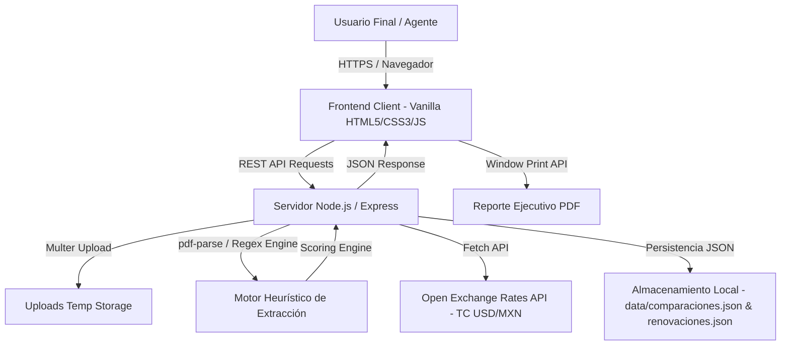
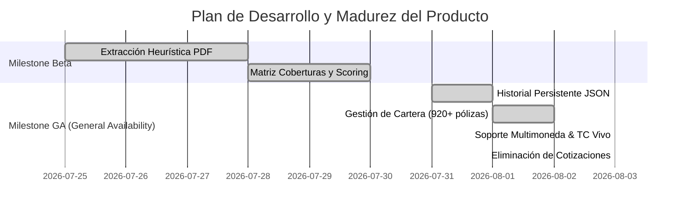

# SegurosCompare 
> **Sistema Automatizado de Análisis y Comparación de Cotizaciones de Seguros**

[](https://nodejs.org/)
[](https://expressjs.com/)
[](LICENSE)
[](https://seguros-compare.onrender.com)

---

## 📑 Tabla de Contenidos (ToC)

- [1. Resumen Ejecutivo](#1-resumen-ejecutivo)
  - [1.1 Descripción](#11-descripción)
  - [1.2 Problema Identificado](#12-problema-identificado)
  - [1.3 Solución Propuesta](#13-solución-propuesta)
  - [1.4 Arquitectura de la Solución](#14-arquitectura-de-la-solución)
- [2. Requerimientos del Sistema](#2-requerimientos-del-sistema)
  - [2.1 Servidores y Entorno de Ejecución](#21-servidores-y-entorno-de-ejecución)
  - [2.2 Base de Datos y Almacenamiento](#22-base-de-datos-y-almacenamiento)
  - [2.3 Paquetes y Dependencias Adicionales](#23-paquetes-y-dependencias-adicionales)
- [3. Instalación](#3-instalación)
  - [3.1 Instalación en Ambiente de Desarrollo Local](#31-instalación-en-ambiente-de-desarrollo-local)
  - [3.2 Ejecución de Pruebas Manuales y Unitarias](#32-ejecución-de-pruebas-manuales-y-unitarias)
  - [3.3 Implementación en Producción (Nube Render / Heroku / Local)](#33-implementación-en-producción-nube-render--heroku--local)
- [4. Configuración](#4-configuración)
  - [4.1 Variables de Entorno y Configuración del Producto](#41-variables-de-entorno-y-configuración-del-producto)
  - [4.2 Configuración de Seguridad y Carga de Archivos](#42-configuración-de-seguridad-y-carga-de-archivos)
- [5. Manuales de Uso](#5-manuales-de-uso)
  - [5.1 Manual de Referencia para Usuario Final](#51-manual-de-referencia-para-usuario-final)
  - [5.2 Manual de Referencia para Usuario Administrador](#52-manual-de-referencia-para-usuario-administrador)
- [6. Guía de Contribución](#6-guía-de-contribución)
- [7. Roadmap y Madurez del Producto](#7-roadmap-y-madurez-del-producto)
  - [7.1 Etapas de Desarrollo (Milestones)](#71-etapas-de-desarrollo-milestones)
  - [7.2 Requerimientos Futuros](#72-requerimientos-futuros)
- [8. Producto y Enlaces](#8-producto-y-enlaces)

>  **Enlaces Externos y Documentación Adicional:**
> - [Wiki del Repositorio en GitHub](https://github.com/kdej94-coder/seguros-compare/wiki)
> - [Documentación en ReadTheDocs.io](https://readthedocs.org/)

---

## 1. Resumen Ejecutivo

### 1.1 Descripción
**SegurosCompare** es un sistema web integral diseñado para automatizar el análisis, comparación y gestión de propuestas de seguros (paquete empresarial, edificios, responsabilidad civil, etc.) a partir de archivos PDF emitidos por aseguradoras en México (ej. GNP, INBURSA, MAPFRE, BERKLEY, CHUBB, AXA). El sistema extrae heurísticamente primas, coberturas, deducibles y sumas aseguradas, permitiendo generar reportes ejecutivos en formato PDF y gestionar la cartera de pólizas a vencer.

### 1.2 Problema Identificado
En la intermediación de seguros, los agentes y ejecutivos de cuenta comparan manualmente las cotizaciones recibidas en PDF de múltiples aseguradoras vaciando los datos en hojas de cálculo (Excel). Este proceso presenta los siguientes inconvenientes:
- **Alta inversión de tiempo:** Tiempos de captura manual elevados por cada propuesta.
- **Riesgo de errores humanos:** Transcripción incorrecta de primas netas, deducibles o sumas aseguradas.
- **Dificultad de interpretación:** Variedad heterogénea de formatos en los PDFs emitidos por cada aseguradora.
- **Falta de estandarización en reportes:** Ausencia de un formato uniforme y profesional para presentar al cliente final.

### 1.3 Solución Propuesta
SegurosCompare resuelve esta problemática mediante:
1. **Motor Heurístico de Procesamiento de PDF:** Extrae automáticamente texto, identifica la aseguradora (vía contenido o nombre de archivo), detecta la prima neta, moneda (MXN/USD), sumas aseguradas y matriz de coberturas.
2. **Normalización Multimoneda con Tipo de Cambio en Vivo:** Permite consultar o ajustar el Tipo de Cambio (TC USD/MXN) en vivo o de forma personalizada para comparar propuestas en dólares y pesos bajo una misma escala.
3. **Motor de Scoring ("Mejor Opción"):** Algoritmo automatizado que evalúa y recomienda la opción más competitiva equilibrando costo y nivel de cobertura.
4. **Módulo de Cartera de Renovaciones:** Integración con la base de datos de pólizas a vencer (920+ registros), permitiendo vincular cotizaciones directamente a cada póliza.
5. **Generador de Reportes Ejecutivos:** Exportación de reportes limpios, elegantes y profesionales listos para impresión/PDF en azul navy y rojo de realce, libres de emojis.

### 1.4 Arquitectura de la Solución

El sistema sigue una arquitectura desacoplada **Model-View-Controller (MVC) ligera** basada en servicios REST sobre Node.js/Express:



---

## 2. Requerimientos del Sistema

### 2.1 Servidores y Entorno de Ejecución
- **Servidor Web / Aplicación:** Node.js (versión `v18.0.0` o superior).
- **Framework HTTP:** Express.js (`v4.19.2`).
- **Plataforma Nube Recomendada:** Render, Heroku o cualquier PaaS compatible con Node.js.

### 2.2 Base de Datos y Almacenamiento
- **Base de Datos Persistente:** Sistema de archivos con persistencia en formato JSON en el directorio `data/`:
  - `data/comparaciones.json`: Historial de comparaciones y cotizaciones procesadas.
  - `data/renovaciones.json`: Cartera de pólizas a vencer (920+ registros).
- **Almacenamiento Temporal de Archivos:** Directorio `uploads/` para el procesamiento temporal de archivos PDF.

### 2.3 Paquetes y Dependencias Adicionales
De acuerdo con el `package.json`:
- `express` (`^4.19.2`): Servidor web y enrutamiento API.
- `multer` (`^1.4.5-lts.1`): Middleware para carga de archivos multipart/form-data.
- `pdf-parse` (`^1.1.1`): Extracción de texto desde documentos PDF.
- `cors` (`^2.8.5`): Habilitación de Cross-Origin Resource Sharing.

---

## 3. Instalación

### 3.1 Instalación en Ambiente de Desarrollo Local

1. **Prerrequisitos:** Asegúrese de tener instalado Node.js (v18+) y Git.
2. **Clonar el repositorio:**
   ```bash
   git clone https://github.com/kdej94-coder/seguros-compare.git
   cd seguros-compare
   ```
3. **Instalar dependencias:**
   ```bash
   npm install
   ```
4. **Iniciar el servidor en modo desarrollo:**
   ```bash
   npm run dev
   ```
5. **Acceder a la aplicación:** Abra su navegador en `http://localhost:3000`.

### 3.2 Ejecución de Pruebas Manuales y Unitarias

El proyecto cuenta con una suite de pruebas unitarias automatizadas en `test/app.test.js` que verifica la extracción de coberturas, el motor de scoring y la autenticación de usuarios.

- **Para ejecutar las pruebas:**
  ```bash
  npm test
  ```
- **Resultado esperado:**
  ```text
   Ejecutando Pruebas Unitarias de SegurosCompare...
     Test 1: Extracción de coberturas Regex superada.
     Test 2: Motor de Scoring ("Mejor Opción") superado.
     Test 3: Autenticación de usuario superada.

  🎉¡TODAS LAS PRUEBAS UNITARIAS PASARON EXITOSAMENTE (3/3)!
  ```

### 3.3 Implementación en Producción (Nube Render / Heroku / Local)

#### Despliegue en Render Cloud (PaaS Recomendado)
1. Conecte su cuenta de Render a su repositorio de GitHub (`kdej94-coder/seguros-compare`).
2. Cree un nuevo **Web Service**.
3. Configure los siguientes parámetros:
   - **Environment:** `Node`
   - **Build Command:** `npm install`
   - **Start Command:** `node server.js`
4. Al hacer push a la rama `main`, Render ejecutará la compilación y despliegue automático.

#### Despliegue en Servidor Local / VPS
1. Configure las variables de entorno en su servidor.
2. Ejecute el comando en modo producción:
   ```bash
   NODE_ENV=production PORT=3000 npm start
   ```

---

## 4. Configuración

### 4.1 Variables de Entorno y Configuración del Producto

El servidor acepta las siguientes variables de entorno (configurables en un archivo `.env` o en la consola del proveedor cloud):

| Variable | Descripción | Valor por Defecto |
|---|---|---|
| `PORT` | Puerto en el que escucha el servidor Express | `3000` |
| `AUTH_PASS` | Contraseña para el acceso al dashboard | `password123` |
| `NODE_ENV` | Entorno de ejecución (`development` / `production`) | `development` |

### 4.2 Configuración de Seguridad y Carga de Archivos
- **Autenticación:** Acceso protegido vía modal de autenticación (`admin` / `password123`).
- **Límite de Carga Multer:** Configurado para recibir hasta 10 archivos PDF simultáneos por solicitud (`upload.array('pdfFiles', 10)`).

---

## 5. Manuales de Uso

### 5.1 Manual de Referencia para Usuario Final
1. **Inicio de Sesión:** Ingrese a la plataforma e introduzca sus credenciales (`admin` / `password123`).
2. **Carga de Cotizaciones PDF:**
   - En la barra lateral o en la pestaña **Mejor Opción**, haga clic en **Subir Cotizaciones PDF**.
   - Seleccione uno o varios archivos PDF de cotizaciones (ej. GNP, INBURSA, MAPFRE, BERKLEY).
3. **Revisión de Resultados:**
   - **Mejor Opción:** Consulte la tarjeta con la recomendación calculada automáticamente.
   - **Resumen General:** Verifique el desglose individual por aseguradora.
   - **Matriz de Coberturas y Deducibles:** Compare cláusula por cláusula las condiciones detectadas.
4. **Tipo de Cambio (USD ➔ MXN):**
   - Edite el campo **`TC USD/MXN`** en el encabezado superior para ajustar el tipo de cambio de referencia. Presione `🔄` si desea actualizar en vivo la tasa oficial.
5. **Generar Reporte Ejecutivo:**
   - Haga clic en **Exportar** en el encabezado.
   - Se abrirá una ventana limpia con el reporte formateado en 4 páginas listo para guardar como PDF o imprimir.

### 5.2 Manual de Referencia para Usuario Administrador
1. **Pestaña Cartera & Reportes:**
   - Visualice el reporte global de participación de aseguradoras (cuentas presentadas y prima neta acumulada).
2. **Desplegar Detalle por Aseguradora:**
   - Haga clic sobre cualquier aseguradora (ej. BERKLEY) para expandir la sub-tabla con las cotizaciones registradas.
3. **Eliminar Cotizaciones Duplicadas o Incorrectas:**
   - En la sub-tabla expandida, haga clic en el botón rojo **`🗑️ Eliminar`**. Confirmé la acción en el cuadro emergente para removerla del historial permanentemente.
4. **Gestión de la Base de Datos de Renovaciones (Cartera 2026):**
   - **Cargar Nueva BD:** Presione **Nueva Base de Datos** para reemplazar el catálogo mediante un archivo `.json` o `.csv`.
   - **Vaciar BD:** Presione **Limpiar BD** para remover los registros almacenados.
5. **Vincular Cotizaciones a Pólizas Específicas:**
   - En la tabla de cartera, ubique la póliza deseada y presione el botón **Cotizar**.
   - Suba los PDFs directamente desde el modal para asociar propuestas a esa póliza particular.

---

## 6. Guía de Contribución

¡Agradecemos las contribuciones a **SegurosCompare**! Para colaborar de forma ordenada, siga estos pasos estrictos:

1. **Clonar el Repositorio:**
   ```bash
   git clone https://github.com/kdej94-coder/seguros-compare.git
   cd seguros-compare
   ```
2. **Crear una Nueva Rama (Branch):**
   Cree una rama con un nombre descriptivo para su funcionalidad o corrección:
   ```bash
   git checkout -b feature/nueva-funcionalidad
   ```
3. **Realizar Cambios y Pruebas:**
   Asegúrese de ejecutar las pruebas unitarias antes de enviar sus cambios:
   ```bash
   npm test
   ```
4. **Realizar Commit de los Cambios:**
   ```bash
   git add .
   git commit -m "feat: agrega soporte para extracción de deducibles en AXA"
   ```
5. **Enviar el Pull Request (PR):**
   Suba su rama al repositorio remoto:
   ```bash
   git push origin feature/nueva-funcionalidad
   ```
   Vaya a GitHub y abra un **Pull Request** detallando los cambios introducidos.
6. **Revisión y Merge:**
   Espere la revisión por parte del administrador del proyecto. Una vez aprobada y pasadas las pruebas automáticas, se realizará el **Merge** a la rama principal (`main`).

---

## 7. Roadmap y Madurez del Producto

### 7.1 Etapas de Desarrollo (Milestones)



- **Etapa Beta (Desarrollo):** Módulo básico de extracción de texto PDF, renderizado preliminar en HTML y motor de evaluación de scoring.
- **Etapa GA (General Availability - Producción):** Versión actual. Incluye soporte multimoneda con conversión de tipo de cambio en vivo, historial persistente `comparaciones.json`, módulo de gestión de cartera de renovaciones, vinculación de cotizaciones por póliza y eliminación con confirmación.

### 7.2 Requerimientos Futuros
- [ ] **Soporte OCR con Tesseract.js / Cloud Vision:** Para procesar PDFs escaneados o imágenes sin capa de texto seleccionable.
- [ ] **Migración a Base de Datos Relacional (PostgreSQL / SQLite):** Sustituir el almacenamiento en archivos JSON por un ORM como Prisma / Sequelize.
- [ ] **Autenticación Robusta con JWT / OAuth2:** Reemplazar la autenticación simple por sesiones con tokens JWT y roles de usuario (Agente vs Administrador).
- [ ] **Integración Directa vía API REST con Aseguradoras:** Conexión mediante Web Services para tarificación automática.

---

## 8. Producto y Enlaces

- ** Producto Desplegado en la Nube (Producción):** [https://seguros-compare.onrender.com](https://seguros-compare.onrender.com)
- **Repositorio Oficial en GitHub:** [https://github.com/kdej94-coder/seguros-compare.git](https://github.com/kdej94-coder/seguros-compare.git)
  

---

*SegurosCompare — Desarrollado como Proyecto Integrador.*

